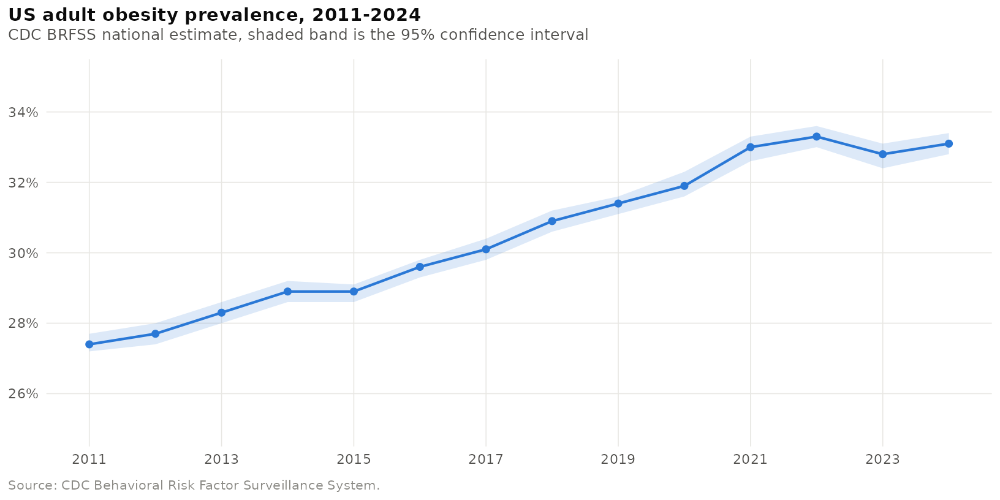
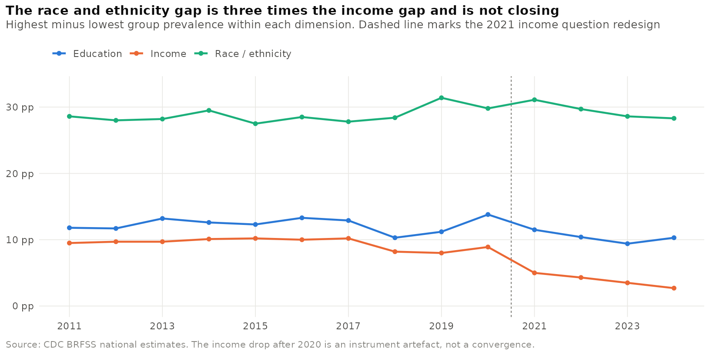
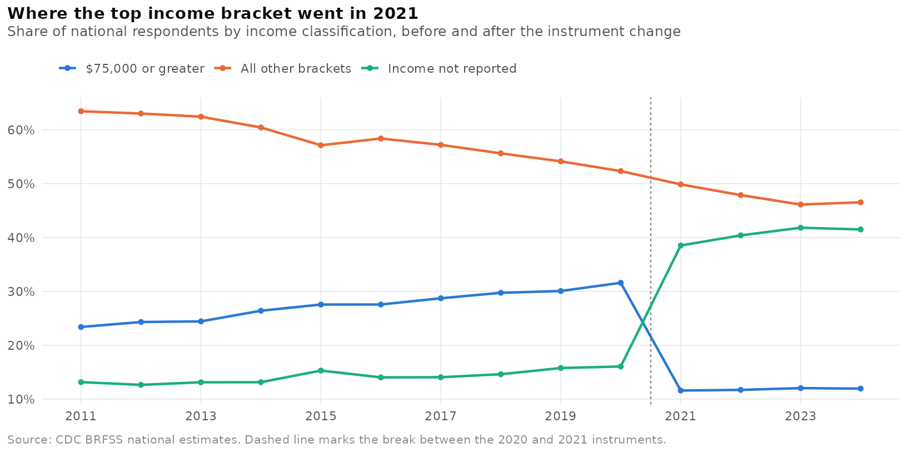
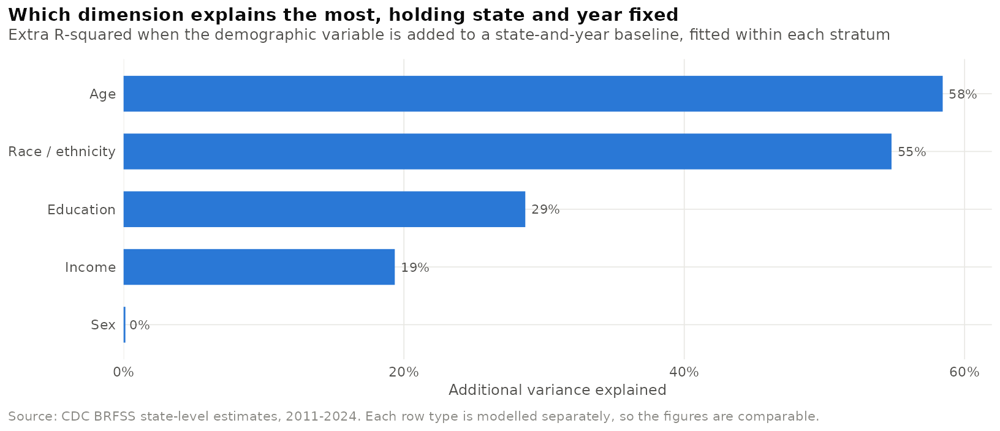

# The Gap That Didn't Close

**Income, race and US adult obesity, 2011-2024**

An analysis of fourteen years of CDC Behavioral Risk Factor Surveillance System
data, asking how adult obesity prevalence varies across income levels and racial
and ethnic groups, and whether those gaps have widened or narrowed.

Written in R with Quarto.

**[Read the full report](https://weston-nyabeze.github.io/projects/obesity-disparity-analysis/obesity-disparity-analysis.html)**

Open that link rather than the `.html` file in the GitHub file listing: GitHub
serves HTML as source code, so only the Pages URL renders the report.

Every chart in the report is interactive. Hover any mark for its underlying
values, click a legend entry to hide a series, double-click one to isolate it,
and drag across a chart to zoom.

---

## What it found

### National prevalence rose from 27.4% to 33.1%



An increase of 5.7 percentage points, or 21% in relative terms, at an average of
0.44 points a year. The rise is close to linear and the confidence intervals are
narrow throughout: the annual national sample runs from roughly 350,000 to
470,000 respondents. Two independent forecasting methods put 2030 prevalence at
roughly 36%.

### The race and ethnicity gap is three times the income gap, and it is not closing



The race gap sits near 29 percentage points for all fourteen years, running from
Non-Hispanic Black adults at the top of the range to Non-Hispanic Asian adults at
the bottom. Among the three largest groups it is closer to 10 points; both figures
belong in an honest summary, and the report gives the decomposition. Neither the
race gap nor the education gap is projected to close by 2030.

### The income gap looks like it collapsed. It didn't.



Read at face value, the gap between the highest and lowest income brackets fell
from 9.5 to 2.7 percentage points, and that would have been the headline finding.
It is an artefact. BRFSS replaced its income question in 2021, and the chart above
shows the mechanism directly: the share of respondents classified as "$75,000 or
greater" fell from 31.6% to 11.6% in a single year while "income not reported"
rose from 16.1% to 38.5%. The top bracket lost its most affluent and
lowest-obesity members, so its measured obesity rate jumped 4.7 points at the same
moment. Within one instrument regime the gap is roughly flat.

The diagnostic that caught this is general and cheap: watch the composition of a
stratification variable over time and treat a large jump as an instrument change
until proven otherwise. Income moved 22.5 points in 2021; no other stratification
variable moves more than 2.1 points in any year of the series.

### Race is the strongest social predictor; income is the weakest of the three



Holding state and year fixed and fitting within each stratum separately, so the
figures are comparable. Age leads, but age is a life-course pattern everyone
passes through rather than a disparity in any policy sense. Among the dimensions
that do constitute disparities, race is first, education second, income third. A
random forest and a gradient boosting model, which compute importance by different
mechanisms, produce the same ordering.

### States lie on a continuum, not in clusters

k-means silhouette widths never exceed 0.29 at any k tried, so the state profiles
are reported as convenient labels rather than as discovered types. The clusters do
recover Census region at p = 0.0017 without ever being given geography, which is a
real validation of the weak structure that exists.

## What is in the repository

| File | What it is |
|---|---|
| `obesity-disparity-analysis.qmd` | The analysis. All code, all narrative, self-contained. |
| `obesity-disparity-analysis.html` | The rendered report, with folded code blocks. |
| `data/brfss_obesity_2011_2024.csv` | The input extract: BRFSS question `Q036`, 21,560 rows. |
| `figures/` | The four static charts on this page, written out by the render. |
| `README.md` | This file. |

The `.qmd` renders from the CSV alone. Nothing else is needed and no step depends
on a file produced by a previous run. The charts above are exported by the same
render, from the same ggplot objects that become the interactive charts in the
report, so the two cannot drift apart.

## How it was built

R 4.3 with Quarto. `tidyverse` for the pipeline, `ggplot2` for every figure with
`plotly` making them interactive, `ranger` and `gbm` for the tree models,
`forecast` for ARIMA, `cluster` for silhouette diagnostics.

Charts are authored once in ggplot and passed through a single conversion
function, so all twenty get the same interaction chrome: confidence bands and
reference lines are dropped from the hover layer, duplicate legend entries are
collapsed, and titles wrap to the content column.

```bash
quarto render obesity-disparity-analysis.qmd
```

## How the analysis is organised

1. **Introduction** - the research question and the four conclusions.
2. **Data loading** - what the extract contains and how it is shaped.
3. **Cleaning and transformation** - numeric fixes, income and age midpoints,
   education ordinal rank, one-hot race, binary sex, geographic parsing, Census
   regions, a suppression flag and a reliability filter. Both the readable
   bracket and the numeric version are kept side by side throughout.
4. **Exploratory analysis** - national trend, income, race, age, the disparity
   gaps, within-stratum correlations, regional patterns, the 2021 discontinuity,
   and a sensitivity check on the two open-ended-bracket assumptions.
5. **Predictive modelling** - linear, random forest and gradient boosting across
   two train/test splits, feature importance, and a cleaner within-stratum test
   of which dimension explains the most.
6. **Forecasting** - ARIMA and linear trend to 2030, gap projections, and a
   backtest showing which method actually holds up.
7. **Clustering** - state disparity profiles, with the honest finding that the
   structure is weak.
8. **Discussion** - what the results support and what they cannot.
9. **Conclusion** - three practical implications and three next steps.

## Three things worth pointing out

**The data has one stratification variable per row.** A row reporting an income
bracket carries no race, no age and no education. The variables never co-occur,
so a conventional feature set treating them as simultaneous predictors cannot be
built from this file. The modelling section pairs every variable with an explicit
"is this variable present" indicator so that a zero means *not applicable* rather
than *zero income*, and the discussion treats ecological inference as a
first-order limitation rather than boilerplate.

**Suppression is not random.** Nine in ten state-year estimates for Native
Hawaiian and Pacific Islander adults are suppressed for insufficient sample, and
roughly a third for Asian and American Indian and Alaska Native adults. The
groups whose disparities are least visible in the published statistics are the
groups the survey is least able to measure. Every state-level race result here is
built on the three largest groups, and the states that drop out as a result are
named.

**Assumptions are stated and tested, not buried.** The open-ended top income
bracket is assigned a $100,000 midpoint and "65 or older" is assigned 75 years.
Both are estimates. Section 4.9 refits the two headline relationships across a
plausible range for each; no conclusion changes.

## Data source

Centers for Disease Control and Prevention, *Nutrition, Physical Activity, and
Obesity - Behavioral Risk Factor Surveillance System*.
[data.cdc.gov](https://data.cdc.gov/Nutrition-Physical-Activity-and-Obesity/Nutrition-Physical-Activity-and-Obesity-Behavioral/hn4x-zwk7/about_data)

The extract in `data/` is filtered to question `Q036`, "Percent of adults aged 18
years and older who have obesity", covering 2011 to 2024 across all 50 states, DC,
Puerto Rico, Guam, the US Virgin Islands and a national aggregate.

---

Weston T. Nyabeze
